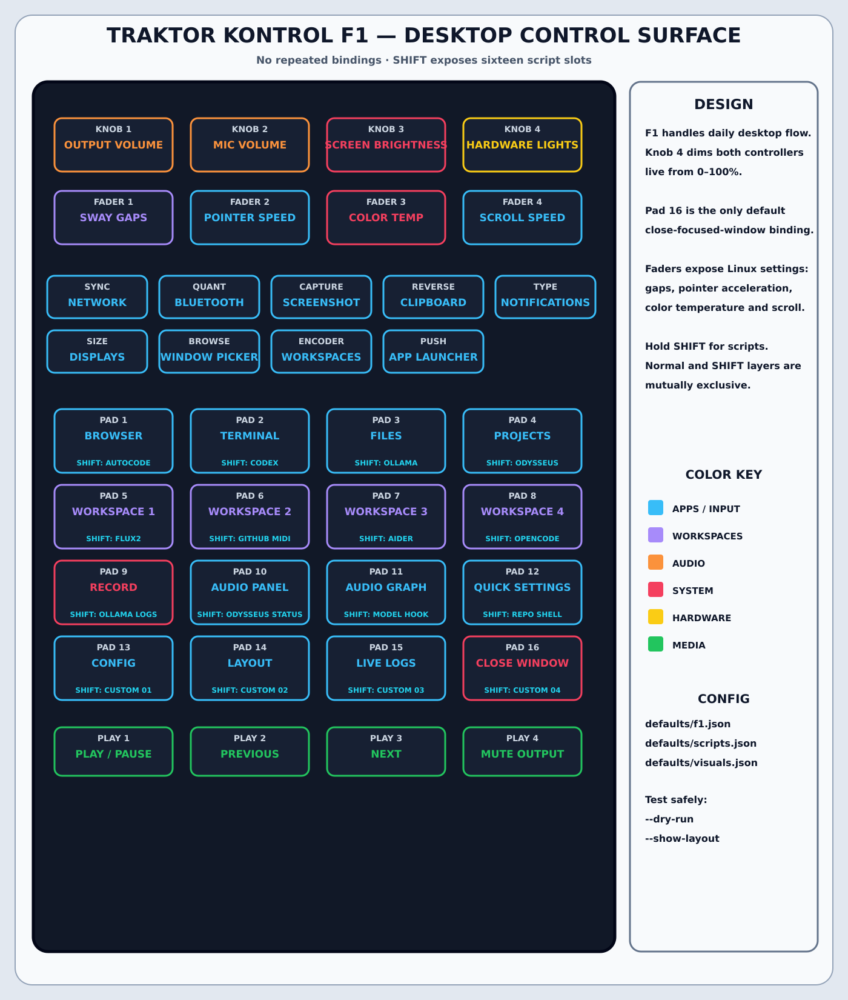
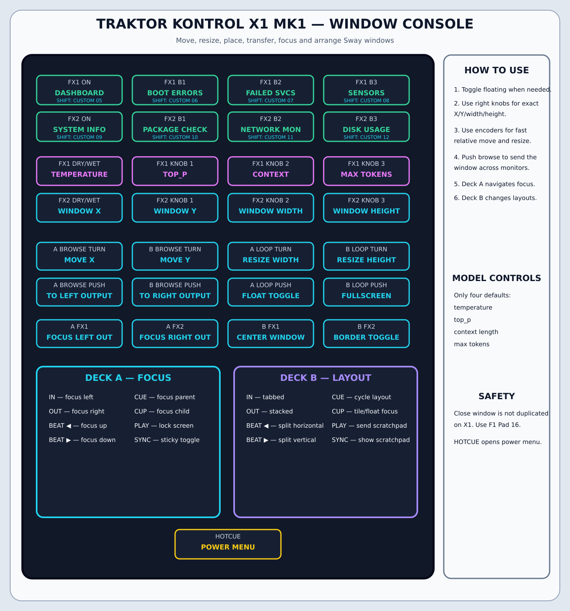

# Traktor X1/F1 Linux System Controller

Use a Native Instruments Traktor Kontrol F1 and X1 MK1 as complementary Garuda
Sway control surfaces.

- **F1:** desktop, media, audio, launchers, Linux input settings and scripts.
- **X1:** window movement, window sizing, monitor transfer, layouts,
  diagnostics and four high-value model parameters.

The default rejects repeated action signatures on the same controller.





## Notable controls

- F1 Knob 4 dims both controllers' hardware lights from 0–100%.
- F1 Pad 16 closes the currently focused Sway window.
- X1 Browse encoders move the focused window horizontally and vertically.
- X1 Loop encoders resize width and height.
- X1 right FX knobs set absolute floating-window X, Y, width and height.
- X1 output buttons move containers and focus between physical screens.
- F1 Shift pads and X1 Shift FX buttons expose 24 configurable script slots.

## Install or upgrade

```fish
curl -L https://raw.githubusercontent.com/generalgroovy/midi/main/setup-and-run.fish \
  -o /tmp/setup-midi.fish
fish /tmp/setup-midi.fish
```

The installer backs up the active configuration when `--reset-config` is used.
Unplug and reconnect the controllers after installation.

## Verify

```fish
traktor-system-controller --list-devices
traktor-system-controller --validate-config
traktor-system-controller --show-layout
```

Test real controls without running actions:

```fish
systemctl --user stop traktor-system-controller.service
traktor-system-controller --dry-run
```

Then start:

```fish
systemctl --user import-environment WAYLAND_DISPLAY SWAYSOCK XDG_CURRENT_DESKTOP
systemctl --user restart traktor-system-controller.service
journalctl --user -u traktor-system-controller.service -f
```

## Configuration

```text
~/.config/traktor-system-controller/config.json
~/.config/traktor-system-controller/defaults/actions.json
~/.config/traktor-system-controller/defaults/model.json
~/.config/traktor-system-controller/defaults/scripts.json
~/.config/traktor-system-controller/defaults/visuals.json
~/.config/traktor-system-controller/defaults/f1.json
~/.config/traktor-system-controller/defaults/x1.json
```

The light dimmer persists to:

```text
~/.config/traktor-system-controller/controller-brightness
```

The four default model controls are temperature, top_p, context length and max
tokens. Additional model parameters remain available for custom mappings.

## Connection consent and LED output

On connection, choose use once, always use, ignore once or never use. The F1
uses HID RGB output. X1 raw USB mode drives button LEDs and restores
`snd-usb-caiaq` on shutdown; evdev fallback remains available without X1 LEDs.

## Documentation

- [`docs/LAYOUT.md`](docs/LAYOUT.md)
- [`docs/VISUAL_MAPPING.md`](docs/VISUAL_MAPPING.md)
- [`docs/CONFIGURATION.md`](docs/CONFIGURATION.md)
- [`docs/SYSTEM_ACTIONS.md`](docs/SYSTEM_ACTIONS.md)

## License

MIT
