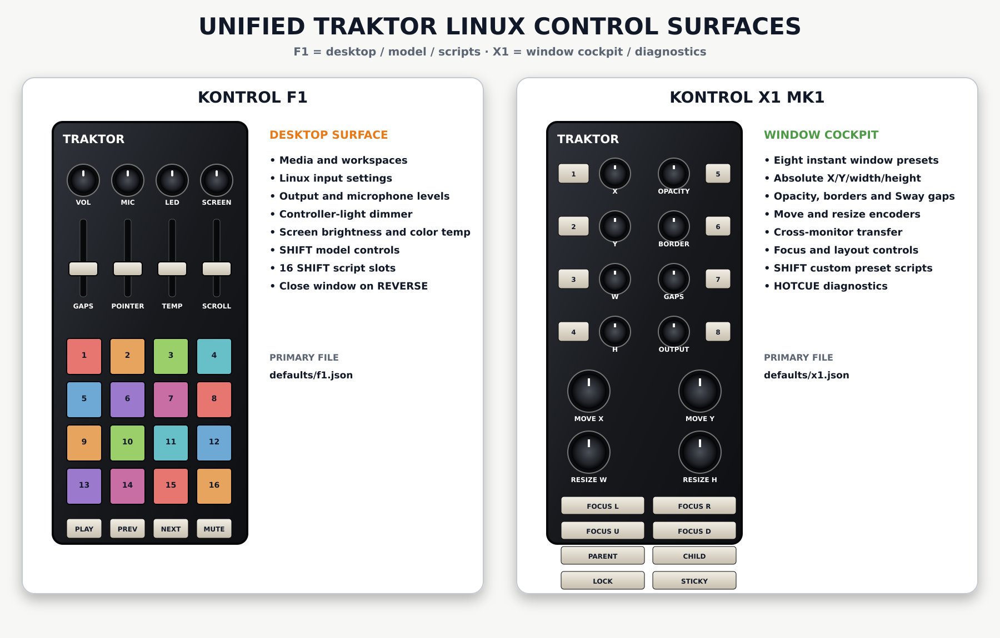

# MIDILIN — Traktor X1/F1 Linux System Controller

Linux/Sway sibling of [MIDIWIN](https://github.com/generalgroovy/midiwin).

Use a Native Instruments Traktor Kontrol F1 and X1 MK1 as complementary Garuda
Sway control surfaces.

- **F1:** desktop, media, audio, Linux settings, local-model parameters and
  sixteen Shift script slots.
- **X1:** focused-window presets, position, size, opacity, borders, output
  selection, layouts, scratchpad, diagnostics and eight Shift script slots.

The validator rejects repeated enabled action signatures on the same controller.



## Unified default highlights

- **F1 Knob 3:** dim all F1 and X1 hardware lights from 0–100%.
- **F1 Knob 4:** display backlight brightness.
- **F1 Fader 3:** display color temperature from 2500–6500 K.
- **F1 Reverse:** close the currently focused Sway window with `swaymsg kill`.
- **F1 Shift + knobs/faders:** eight local-model parameters.
- **X1 FX1 knobs:** focused-window X, Y, width and height.
- **X1 FX2 knobs:** opacity, border width, Sway gaps and output selection.
- **X1 Browse encoders:** move the focused window horizontally and vertically.
- **X1 Loop encoders:** resize width and height.
- **X1 upper buttons:** center, half-screen, maximum, top, bottom, PiP and reset
  window presets.
- **X1 HOTCUE layer:** monitoring and maintenance commands.

The close-window action has exactly one default binding.

## Install, reconcile local branches and run

```fish
curl -L https://raw.githubusercontent.com/generalgroovy/midilin/main/setup-and-run.fish \
  -o /tmp/setup-midilin.fish
fish /tmp/setup-midilin.fish
```

Unplug and reconnect both controllers after installation when udev rules change.

## Verify

```fish
traktor-system-controller --validate-config
traktor-system-controller --show-layout
traktor-system-controller --list-devices
```

Test real controls without executing actions:

```fish
systemctl --user stop traktor-system-controller.service
traktor-system-controller --dry-run
```

Start normally:

```fish
systemctl --user import-environment WAYLAND_DISPLAY SWAYSOCK XDG_CURRENT_DESKTOP
systemctl --user restart traktor-system-controller.service
journalctl --user -u traktor-system-controller.service -f
```

## Configuration

```text
~/.config/traktor-system-controller/config.json
~/.config/traktor-system-controller/defaults/actions.json
~/.config/traktor-system-controller/defaults/model.json
~/.config/traktor-system-controller/defaults/scripts.json
~/.config/traktor-system-controller/defaults/visuals.json
~/.config/traktor-system-controller/defaults/f1.json
~/.config/traktor-system-controller/defaults/x1.json
```

## Documentation

- [`docs/LAYOUT.md`](docs/LAYOUT.md)
- [`docs/VISUAL_MAPPING.md`](docs/VISUAL_MAPPING.md)
- [`docs/CONFIGURATION.md`](docs/CONFIGURATION.md)
- [`docs/SYSTEM_ACTIONS.md`](docs/SYSTEM_ACTIONS.md)

## Related project

- Linux/Sway: **MIDILIN** — this repository
- Windows: **[MIDIWIN](https://github.com/generalgroovy/midiwin)**

## License

MIT
