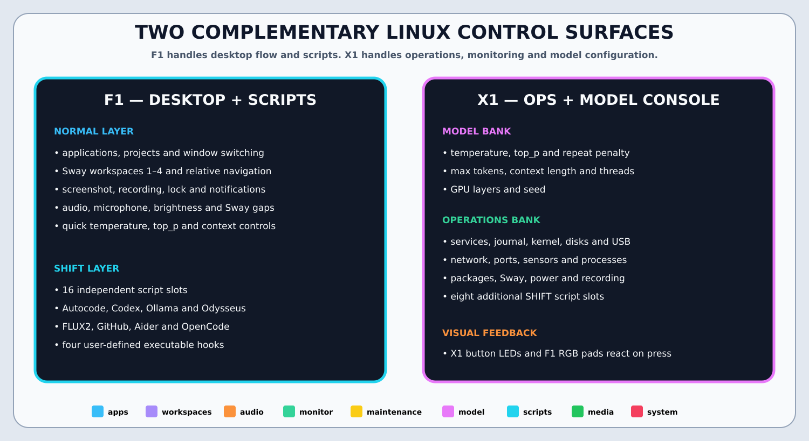

# Traktor X1/F1 Linux System Controller

Turn a Native Instruments **Traktor Kontrol F1** and **X1 MK1** into two
complementary Garuda Sway control surfaces.



The default is intentionally not DJ-oriented and does not mirror actions across
the same controller:

- **F1:** desktop flow, media, audio, applications, workspaces, hardware-light
  brightness, local-model parameters and sixteen configurable script slots.
- **X1:** focused-window position, size, opacity, border, output, layout,
  scratchpad, diagnostics and eight additional script slots.

## Install or upgrade

```fish
curl -L https://raw.githubusercontent.com/generalgroovy/midi/main/setup-and-run.fish \
  -o /tmp/setup-midi.fish
fish /tmp/setup-midi.fish
```

The setup script clones or updates `~/Projects/midi`, requests sudo
interactively, installs the udev rules and Python dependencies, resets the
default configuration with a backup, and starts the user service.

Unplug and reconnect both controllers after installation. The service asks
whether to use each detected unit once, always, ignore once or never.

## F1 default map

[](docs/LAYOUT.md#f1--desktop-media-lights-and-local-model-controls)

Key defaults:

- **Knob 1:** output volume.
- **Knob 2:** microphone volume.
- **Knob 3:** live brightness for all F1 and X1 hardware lights.
- **Knob 4:** display brightness.
- **Reverse:** close the currently focused Sway window with `swaymsg kill`.
- **Type / Size:** fullscreen / floating toggle.
- **Shift + Knobs 1–4:** temperature, top-p, repeat penalty and max tokens.
- **Faders 1–4:** context length, threads, GPU layers and seed.
- **Shift + Pads 1–16:** Autocode, Codex, Ollama, Odysseus, FLUX2 and custom
  scripts.

The hardware-light value is persisted in:

```text
~/.config/traktor-system-controller/light-brightness.json
```

## X1 default map

[](docs/LAYOUT.md#x1--focused-window-cockpit)

The eight upper knobs are a focused-window geometry panel:

| Control | Default action |
|---|---|
| FX1 Dry/Wet | Window X position across the full active-screen canvas |
| FX1 Knob 1 | Window Y position |
| FX1 Knob 2 | Window width |
| FX1 Knob 3 | Window height |
| FX2 Dry/Wet | Window opacity |
| FX2 Knob 1 | Border width |
| FX2 Knob 2 | Global Sway inner gaps |
| FX2 Knob 3 | Move the focused container to an active output |

Position and size controls automatically enable floating mode. Upper buttons
apply center, half-screen, maximum, picture-in-picture and reset presets.
Browse and loop encoders focus and move containers. Hold `HOTCUE` to replace
the transport actions with system monitoring and maintenance commands.

## Configuration

The active root file is:

```text
~/.config/traktor-system-controller/config.json
```

It includes:

```text
~/.config/traktor-system-controller/defaults/actions.json
~/.config/traktor-system-controller/defaults/model.json
~/.config/traktor-system-controller/defaults/scripts.json
~/.config/traktor-system-controller/defaults/visuals.json
~/.config/traktor-system-controller/defaults/f1.json
~/.config/traktor-system-controller/defaults/x1.json
```

The validator rejects duplicate enabled action signatures on the same
controller. Script slots and model parameters are treated as distinct by slot
or parameter name.

## Script slots

Edit:

```fish
nano ~/.config/traktor-system-controller/defaults/scripts.json
```

Example:

```json
{
  "script_slots": {
    "custom_01": {
      "label": "Start local agent",
      "enabled": true,
      "confirm": "Start the local coding agent?",
      "command": [
        "foot",
        "--working-directory=/home/otp/Projects/flux2",
        "fish",
        "-lc",
        "autocode; exec fish"
      ]
    }
  }
}
```

## Model controls

The default model values are persisted in:

```text
~/.config/traktor-system-controller/model-controls.json
```

Supported parameters:

```text
temperature  top_p  repeat_penalty  max_tokens
context_length  threads  gpu_layers  seed
```

Each update is debounced before invoking:

```text
~/.config/traktor-system-controller/hooks/model-controls-updated
```

## Visual themes

```fish
traktor-system-controller --list-themes
traktor-system-controller --set-theme neon
systemctl --user restart traktor-system-controller.service
```

Themes: `category`, `neon`, `matrix`, `sunset`, `mono`, `blackout`.
The hardware-light knob scales every theme without changing its colors.

## Validate and test

```fish
traktor-system-controller --validate-config
traktor-system-controller --show-layout
traktor-system-controller --list-devices

systemctl --user stop traktor-system-controller.service
traktor-system-controller --dry-run
traktor-system-controller --monitor
```

Restart normally:

```fish
systemctl --user import-environment WAYLAND_DISPLAY SWAYSOCK XDG_CURRENT_DESKTOP
systemctl --user restart traktor-system-controller.service
journalctl --user -u traktor-system-controller.service -f
```

Documentation:

- [`docs/LAYOUT.md`](docs/LAYOUT.md) — exact default bindings and layers.
- [`docs/VISUAL_MAPPING.md`](docs/VISUAL_MAPPING.md) — diagrams and LED behavior.
- [`docs/CONFIGURATION.md`](docs/CONFIGURATION.md) — overrides, script slots,
  themes, connection policy and model controls.
- [`docs/SYSTEM_ACTIONS.md`](docs/SYSTEM_ACTIONS.md) — monitoring helpers.

## License

MIT
