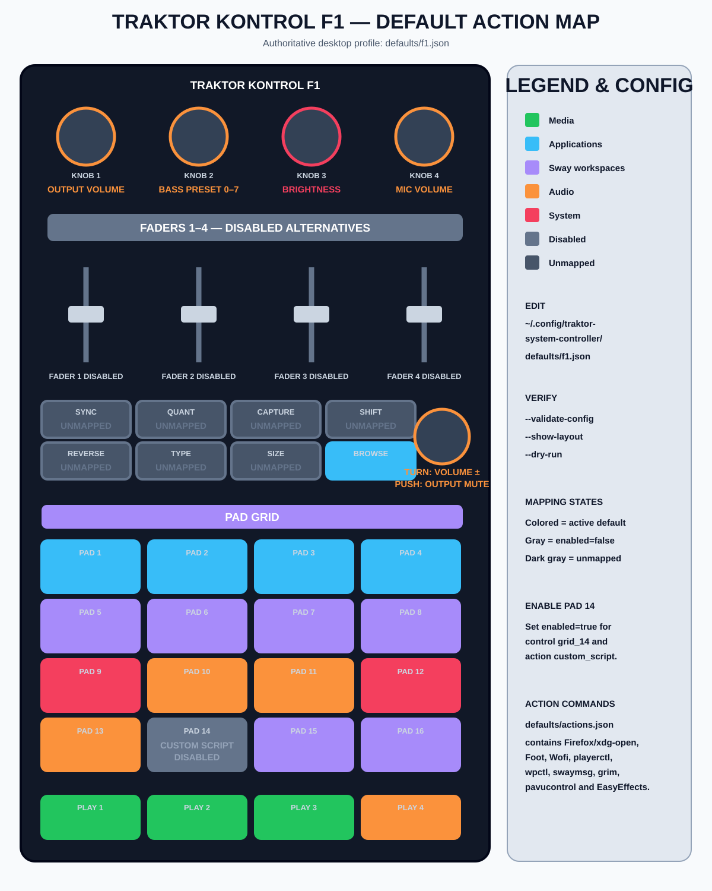
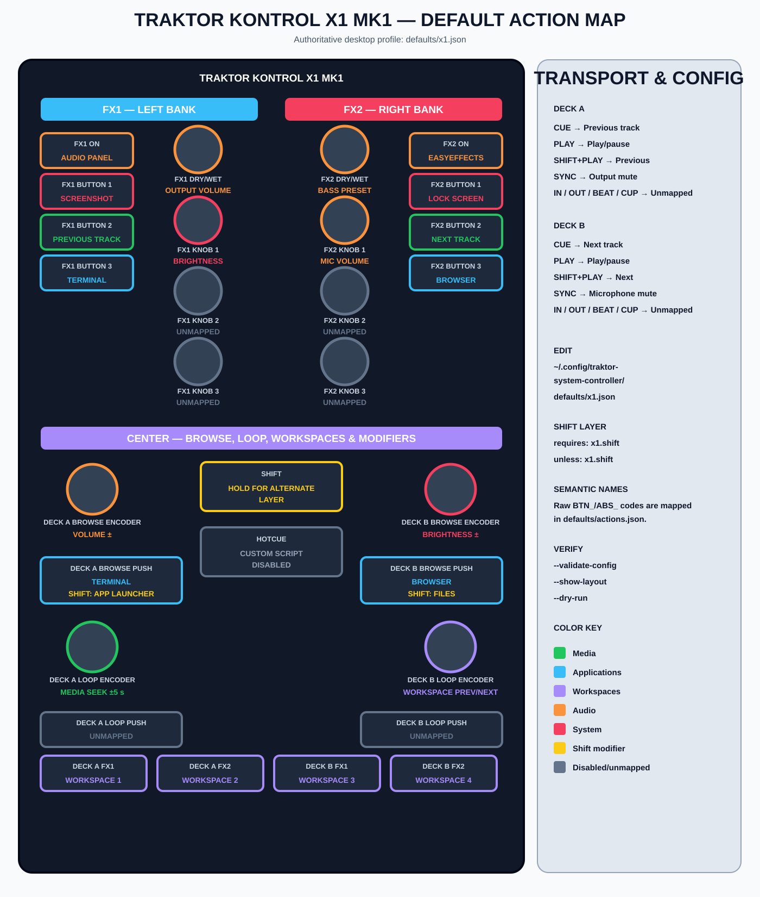

# Default desktop layout

Run `traktor-system-controller --show-layout` for the authoritative active
profile. The default is intentionally practical rather than DJ-oriented.

For controller-shaped diagrams with active actions, Shift behavior, disabled
hooks and unmapped controls, see [`VISUAL_MAPPING.md`](VISUAL_MAPPING.md).

## F1

| Control | Action |
|---|---|
| Play 1 / 2 / 3 | Play-pause / previous / next |
| Play 4 | Toggle output mute |
| Pads 1–4 | Browser / terminal / files / launcher |
| Pads 5–8 | Sway workspaces 1–4 |
| Pads 9–13 | Screenshot / audio controls / EasyEffects / lock / mic mute |
| Pad 14 | Disabled custom-script hook |
| Pads 15–16 | Previous / next workspace |
| Knobs 1–4 | Output volume / bass preset / brightness / microphone volume |
| Browse encoder | Relative output volume |
| Browse push | Toggle output mute |
| Browse button | Application launcher |
| Faders 1–4 | Disabled alternatives |
| Sync / Quant / Capture / Shift / Reverse / Type / Size | Unmapped |

## X1 MK1

| Control | Action |
|---|---|
| Deck A/B Play | Play-pause |
| Shift + Deck A/B Play | Previous / next track |
| Deck A/B Cue | Previous / next track |
| Deck A/B Sync | Output mute / microphone mute |
| Deck A/B Browse encoder | Volume / brightness |
| Deck A/B Loop encoder | Seek / change workspace |
| Deck A Browse push | Terminal; Shift: launcher |
| Deck B Browse push | Browser; Shift: files |
| Deck FX1/FX2 buttons | Workspaces 1–4 |
| FX1/FX2 On | PipeWire controls / EasyEffects |
| FX1 buttons 1–3 | Screenshot / previous / terminal |
| FX2 buttons 1–3 | Lock / next / browser |
| FX1/FX2 dry-wet | Output volume / bass preset |
| FX1/FX2 knob 1 | Brightness / microphone volume |
| FX knobs 2–3 | Unmapped |
| Loop pushes | Unmapped |
| Transport In / Out / Beat / Cup | Unmapped |
| Hotcue | Disabled custom-script hook |

The X1 semantic aliases are derived from the stable `snd-usb-caiaq` evdev
layout. Override any raw-to-semantic name under `control_aliases.x1`.

## Profiles and layers

Set `active_profile` or launch with `--profile NAME`. Use `profile` or
`profiles` on individual mappings. Use `requires` and `unless` for held-button
layers; modifier tokens accept `x1.shift`, `x1:shift`, or same-device `shift`.
