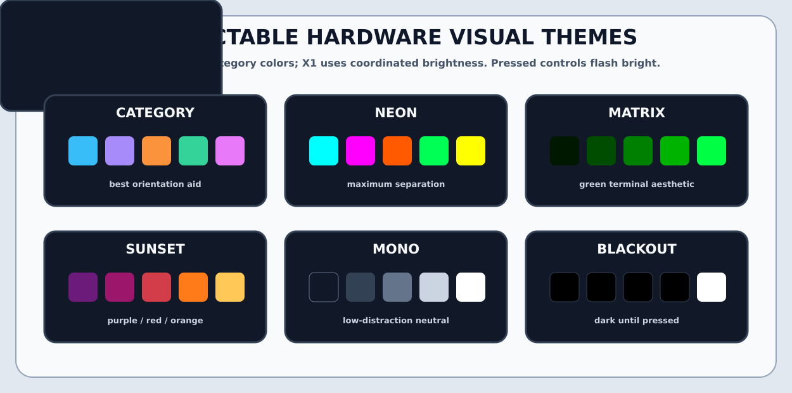

# Visual mapping

The diagrams are generated from the same semantic control names used by the
configuration fragments. They distinguish applications, workspaces, audio,
model parameters, monitoring, maintenance, scripts, media and system actions.

## F1 desktop + script surface


The normal layer is a complete Sway desktop surface. Hold the physical `SHIFT`
button while pressing any pad to select the script-slot label printed beneath
the pad's normal action.

Configuration sources:

```text
defaults/f1.json
defaults/scripts.json
defaults/model.json
```

## X1 system operations + model console


The upper bank is split between local-model configuration and system status.
Hold `SHIFT` with the eight upper FX buttons to access `custom_05` through
`custom_12`.

Configuration sources:

```text
defaults/x1.json
defaults/scripts.json
defaults/model.json
```

## Visual themes



| Theme | Behavior |
|---|---|
| `category` | Action-category palette; best orientation aid |
| `neon` | Maximum saturated color separation |
| `matrix` | Green terminal aesthetic |
| `sunset` | Purple, red and orange palette |
| `mono` | Low-distraction neutral palette |
| `blackout` | LEDs remain dark until a control is pressed |

Apply a theme:

```fish
traktor-system-controller --set-theme matrix
systemctl --user restart traktor-system-controller.service
```

## Hardware feedback

F1 output report `0x80` drives:

- RGB values for all sixteen pads;
- brightness for `SYNC`, `QUANT`, `CAPTURE`, `SHIFT`, `REVERSE`, `TYPE`, `SIZE`
  and `BROWSE`;
- both LEDs beneath each of the four play buttons.

The X1 raw backend writes its 32-byte LED state through USB endpoint `0x01` and
reads the device's unlock response. Mapped buttons have an idle level and flash
at full brightness while physically held.

Set:

```json
{
  "hardware": {
    "x1_backend": "evdev"
  }
}
```

to disable raw USB control and use kernel evdev input without X1 LED output.
